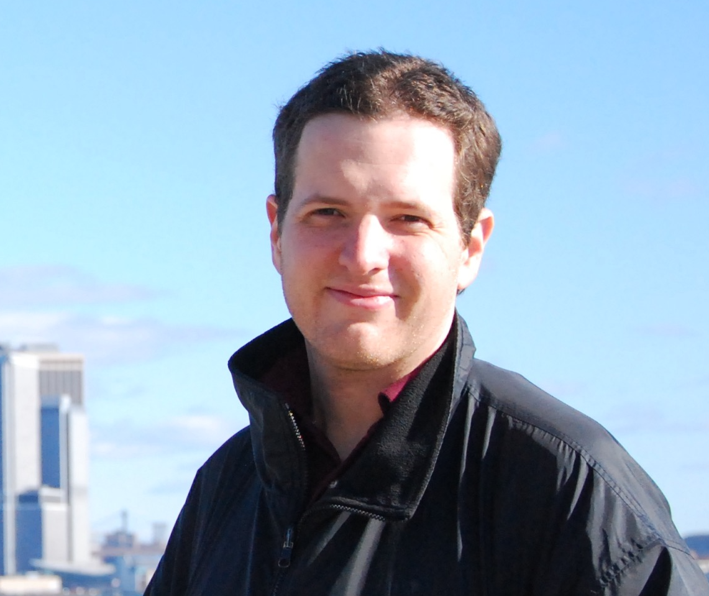

{ class=avatar }
Andrew Mann is an Assistant Professor at the University of North Carolina at Chapel Hill. His research focuses on the fundamental properties of low-mass or young stars, as well as the planets that orbit them. He is the PI of the Zodiacal Exoplanets in Time (ZEIT) and co-PI of the TESS Hunt for Young and Maturing Exoplanets (THYME) surveys, both of which focus on the discovery, characterization, and demographics of transiting planets in young (5-800 Myr) associations. He also studies the atmospheres of young planets with HST, JWST, and ground-based facilities.
